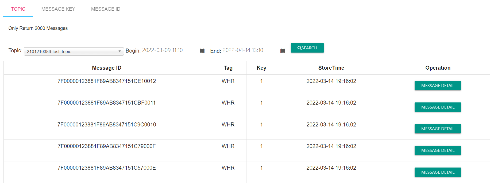
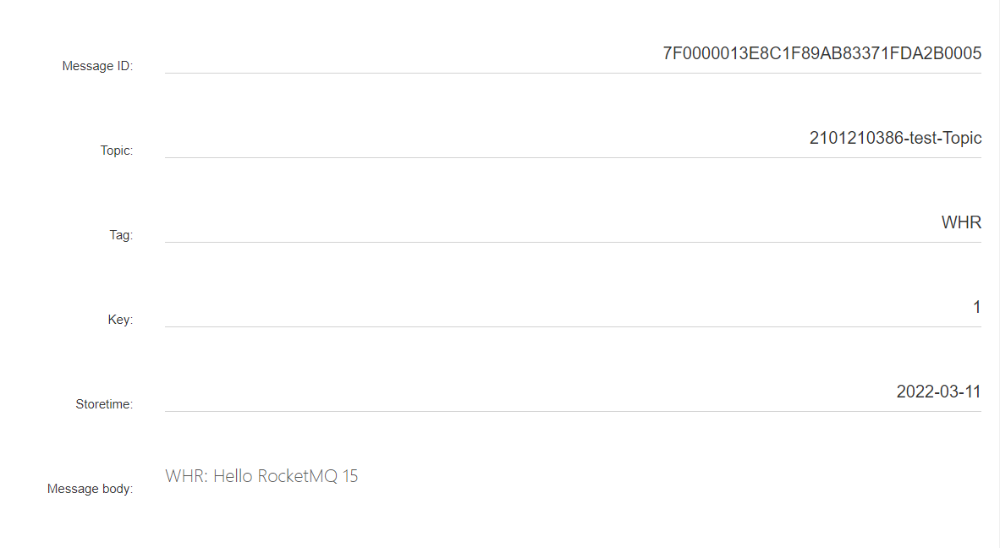
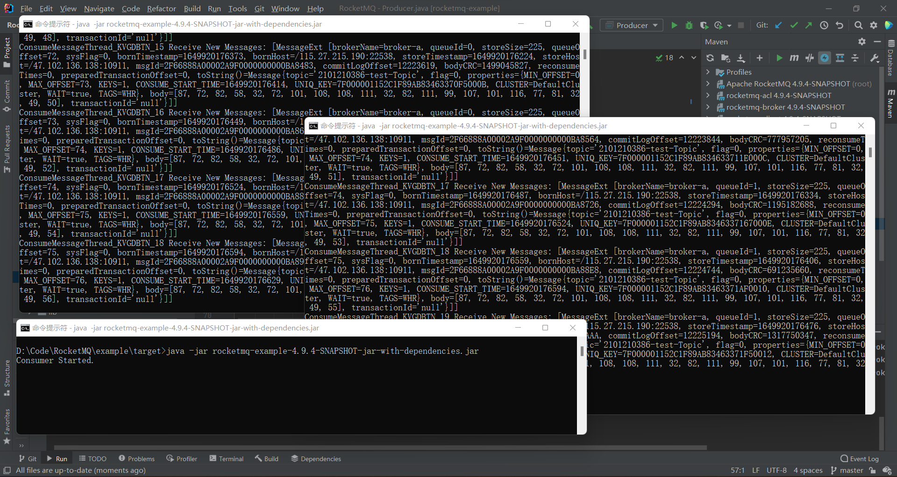

### 1.把example跑起来，能在dashboard中查到自己发送的消息
新建Topic：2101210386-test-Topic  
发送消息：  

根据Topic查询：

根据MsgID查询：  
MsgID：7F0000013E8C1F89AB83371FDA2B0005

### 2.把消费者打成jar包，在自己的电脑上同时跑2个进程，看看会发生什么现象，然后解释下可能的原因
>同时运行1个Consumer:  

>同时运行2个Consumer:  

>同时运行3个Consumer:   

Topic：2101210386-test-Topic 设定的readQueue值为2。  
可以看到，只有一个Consumer的时候，Consumer消费了queueId=0和queueId=1的消息。Consumer增加到两个的时候，原有的Consumer只消费queueId=0的消息，新增的Consumer只消费queueId=1的消息。而Consumer进一步增加的时候，新的Consumer不会消费任何消息。
一个Topic的消息被分为多个队列。在同一个ConsumerGroup中，Consumer会固定的分配到一个或几个队列读取消息；但是一个队列只会分配给一个Consumer。