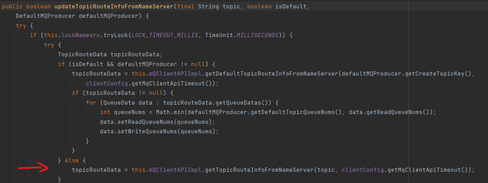
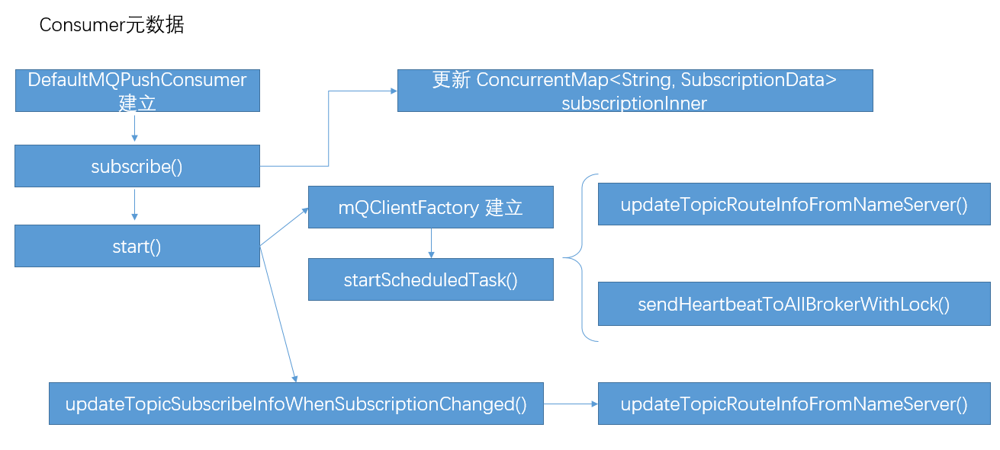

## 1. 为什么Demo里面没有创建Topic，却可以使用？
跟踪quickstart中Producer类的Message发送过程，依次调用
`DefaultMQProducer.send()`，`DefaultMQProducerImpl.send()`，`DefaultMQProducerImpl.sendDefaultImpl()`。  
在`sendDefaultImpl()`中，调用`tryToFindTopicPublishInfo()`获取TopicPublishInfo。可以看到，该方法首先访问本地的topicPublishInfoTable缓存，没有找到Topic的信息则调用mQClientFactory.`updateTopicRouteInfoFromNameServer()`方法从NameServer获取Topic信息。此时isDefault=false，进入下方的分支。

转到NameServer的实现中，搜索 `RequestCode.GET_ROUTEINFO_BY_TOPIC` 找到函数 `getRouteInfoByTopic()` 

阅读该函数及其子过程，发现对于没有定义的Topic，只是返回`ResponseCode.TOPIC_NOT_EXIST`的错误信息，而没有进行新Topic的创建。

再跳回到Producer调用的updateTopicRouteInfoFromNameServer()方法中，看一下是怎么处理这个返回信息的。在异常处理中发现了`TopicValidator.AUTO_CREATE_TOPIC_KEY_TOPIC`，应该和创建新的Topic有关系。查找引用发现，`defaultMQProducer.getCreateTopicKey()`返回的`DefaultMQProducer.createTopicKey`就是这个值。当`tryToFindTopicPublishInfo()`从NameServer没有Topic时，令isDefault=true，Producer使用事先约定好的Topic查询RouteInfo，并将其作为新的Topic的RouteInfo。

也就是说，此时新的Topic将发往接受`TopicValidator.AUTO_CREATE_TOPIC_KEY_TOPIC`这个Topic的Broker。

在Broker中搜索`TopicValidator.AUTO_CREATE_TOPIC_KEY_TOPIC`,可以定位到`createTopicInSendMessageMethod()`，这个函数负责建立新Topic。查找其引用可以发现，是在Broker回复消息前进行检查时，`msgCheck()`方法在Broker上找不到Topic，试图建立新的Topic。

## 2. 元数据的生命周期

Consumer订阅的Topic信息存储在`ConcurrentMap<String , SubscriptionData> subscriptionInner` 结构中。  
在Consumer开始运行的时候，建立了两个定时任务来维护Broker的相关信息：  `updateTopicRouteInfoFromNameServer()
`从NameServer拉取Topic对应的Broker地址。  `sendHeartbeatToAllBrokerWithLock()` 向所有的Broker发送心跳消息，更新自己订阅的Topic信息和其他设置。