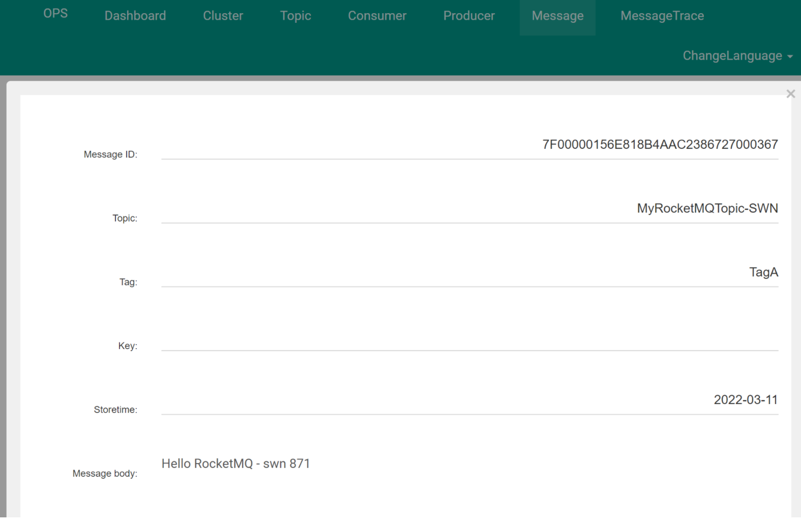
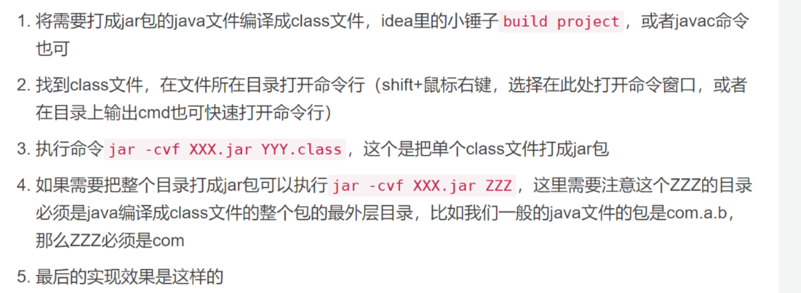

## RocketMQ发送与消费消息


### 问题1：消息的发送与消费


#### producer


```java
 public static void main(String[] args) throws MQClientException, InterruptedException {
        //1.创建producer并指定producer组
        DefaultMQProducer producer = new DefaultMQProducer("producer-test-swn-0311");

        //2.配置相关信息
        ResourceBundle bundle = ResourceBundle.getBundle(PROPERTIES_NAME);
        producer.setNamesrvAddr(bundle.getString(NAMESRV_ADDR));
        producer.setUseTLS(false);

        //3.启动producer
        producer.start();

        for (int i = 0; i < TIMES; i++) {
            try {
                //4.创建消息并发送
                Message msg = new Message("MyRocketMQTopic-SWN" /* Topic */,
                    "TagA" /* Tag */,
                    ("Hello RocketMQ - swn " + i).getBytes(RemotingHelper.DEFAULT_CHARSET) /* Message body */
                );
                SendResult sendResult = producer.send(msg);
                System.out.printf("%s%n", sendResult);
            } catch (Exception e) {
                e.printStackTrace();
                Thread.sleep(1000);
            }
        }
        producer.shutdown();
    }
```


#### consumer


```java
public static void main(String[] args) throws InterruptedException, MQClientException {


        DefaultMQPushConsumer consumer = new DefaultMQPushConsumer("consumer-test-swn0311");

        ResourceBundle bundle = ResourceBundle.getBundle(PROPERTIES_NAME);
        consumer.setNamesrvAddr(bundle.getString(NAMESRV_ADDR));


        //consumer.setConsumeFromWhere(ConsumeFromWhere.CONSUME_FROM_FIRST_OFFSET);


        consumer.subscribe("MyRocketMQTopic-SWN", "*");

        consumer.registerMessageListener(new MessageListenerConcurrently() {

            @Override
            public ConsumeConcurrentlyStatus consumeMessage(List<MessageExt> msgs,
                ConsumeConcurrentlyContext context) {

                try {
                    for (MessageExt msg : msgs) {
                        String msgId = msg.getMsgId();
                        byte[] body = msg.getBody();
                        String message = new String(body, 0, body.length, Charset.forName("utf-8"));
                        System.out.println("Time: "+ System.currentTimeMillis() + "- " + "MsgId: " + msgId + " --- " + message);
                    }
                } catch (Exception e) {
                    e.printStackTrace();
                    return ConsumeConcurrentlyStatus.RECONSUME_LATER;
                }
                return ConsumeConcurrentlyStatus.CONSUME_SUCCESS;
            }
        });
        consumer.start();

        System.out.printf("Consumer Started.%n");
    }
```


**通过Topic查询发送的Message**


**通过MsgId查询Message**




问题2：多线程消费的现象与原理

把消费者打成jar包， 在自己的电脑上同时跑2个进程（也就是执行2次 java -jar xxxxConsumer.jar ), 看看会发生什么现象， 然后解释下可能的原因。




