## 第四周_RocketMQ设计与代码 _思考题

### 一、为什么Demo里面没有创建Topic，却可以使用？

#### Producer端

沿着Producer Demo中的send()方法，一路向下调用发现发送的主干流程中没有对Topic进行相关处理，继续搜索返回来到寻找`topicPublishInfo`的方法，因为没有创建Topic，所以无法从map中获取到`topicPublishInfo`，进入第一个if中的寻找路由信息的`updateTopicRouteInfoFromNameServer()`方法

因为`isDafault == false`，所以进入else中的`getTopicRouteInfoFromNameServer()`方法

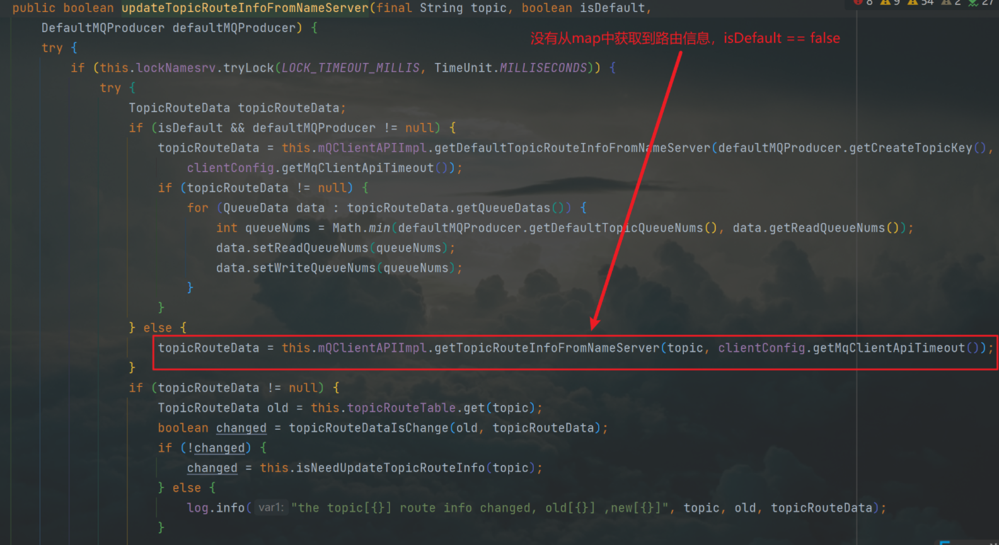

继续向下调用，发现`allowTopicNotExist`参数设置为true，说明其允许Topic不存在，进入内层调用发现调用了网络层方法获得一个响应，然后就打印日志，抛出异常了，流程到此发生了小小的中断，那么**核心就是这个向上抛出的`MQClientException`异常到底被哪个方法捕捉到了然后进行了什么样的处理**...

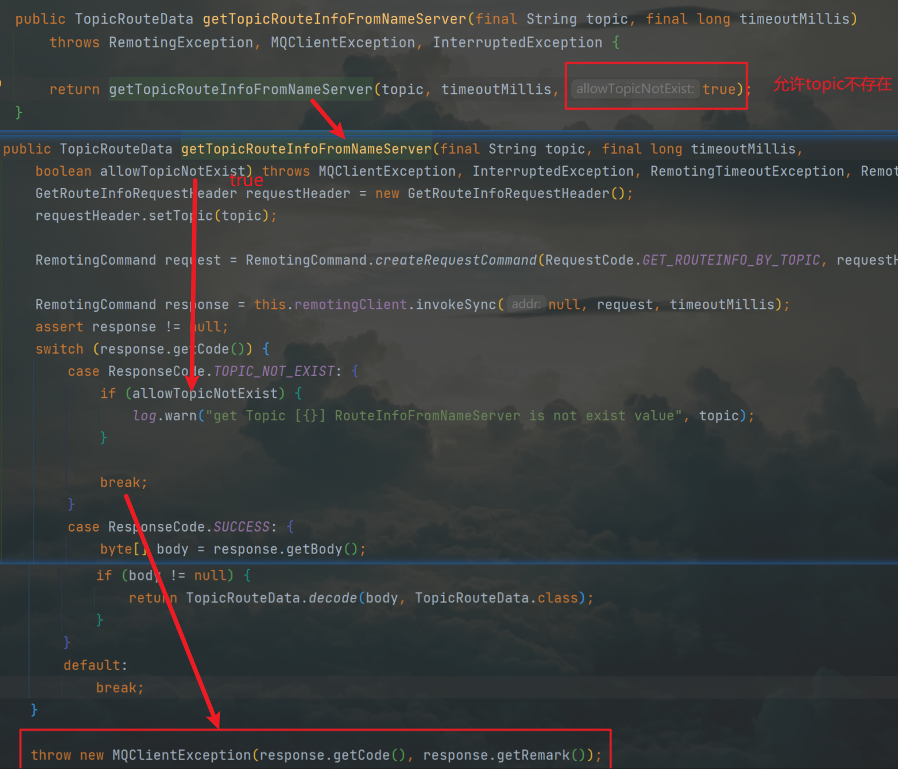

向上返回，我们发现这个`MQClientException`异常最终是被`MQClientInstance`类中的`updateTopicRouteInfoFromNameServer()`方法捕捉到然后进行了处理，我们在catch代码块的逻辑中发现其中一个很可能跟自动创建Topic相关的参数`TopicValidator.AUTO_CREATE_TOPIC_KEY_TOPIC`

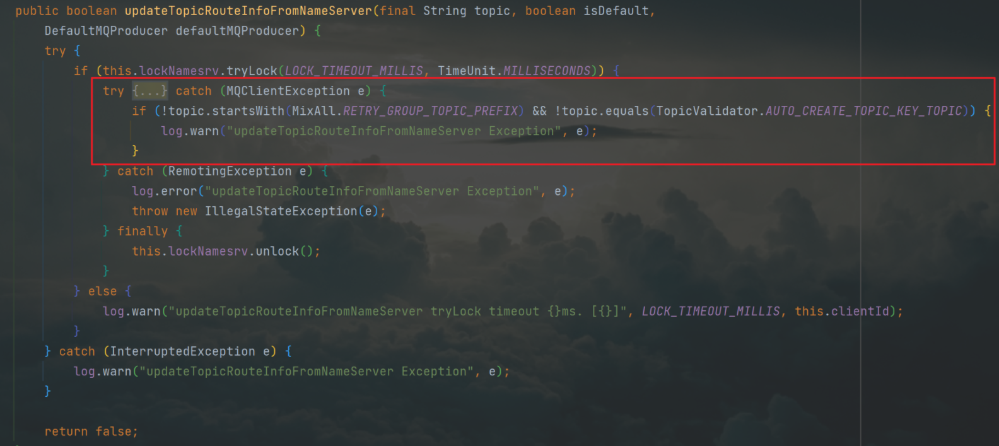

进入`TopicValidator`类，我们发现了这个参数以及后面的注释：当`autoCreateTopicEnable`参数开启时将会自动创建该Topic，所以我们就得到了一个结论：

当启动broker时如果我们传入了`autoCreateTopicEnable = true`的配置, 那么这个TBW102的Topic就会在broker启动时自行创建。

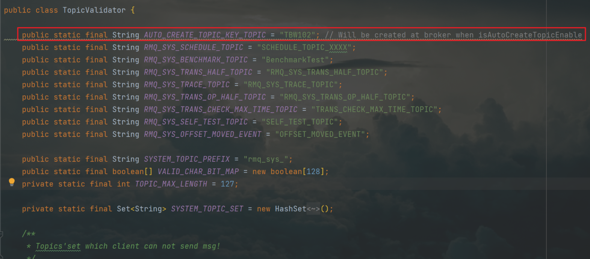

启动broker配置`autoCreateTopicEnable = true`的命令如下：

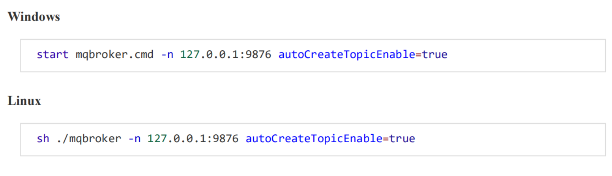

我们在寻找路由信息时因为第一次抛出异常没有找到，然后需要再次寻找，调用else中`updateTopicRouteInfoFromNameServer`,传入`isDefault`为true

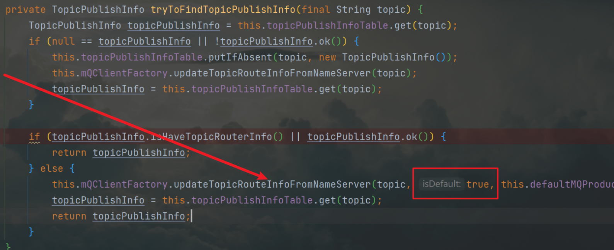

进到下层调用，`isDefault`为true时调用了`getDefaultTopicRouteInfoFromNameServer()`方法，其中获取到了第一次初始化的`TopicValidator.AUTO_CREATE_TOPIC_KEY_TOPIC`,即TBW102,基于这个topic通过网络层获取到路由信息，然后检查该路由信息与从map中获得的路由信息相比是否发生变化，发生变化了就把其加入map

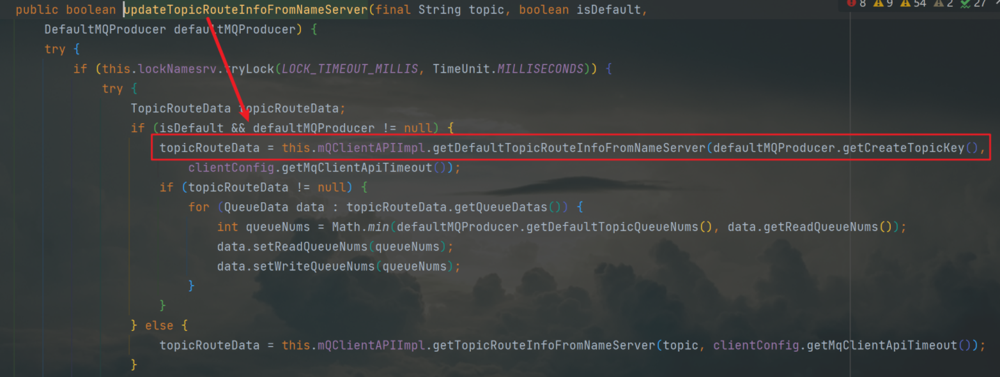

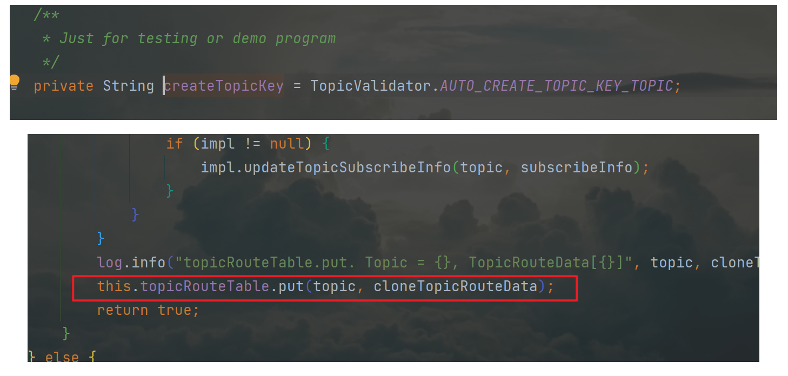

获取到路由信息后继续走`sendDefaultImpl()`方法的流程，再调用`sendKernelImpl()`方法，把`topicPublishInfo`传入，然后设置到`requestHeader`请求头中的`defaultTopic`属性中，然后再将`requestHeader`封装到`RemotingCommand`中

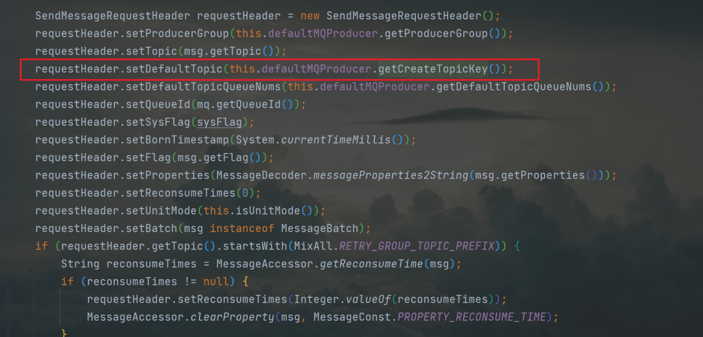

#### Broker端

还有个疑问就是：当`AutoCreateTopicEnable = true`时该Topic在broker端具体是怎么创建的？

我们继续寻找Broker启动的方法：

`BrokerStartUp类中的 main方法()`，创建了一个`BrokerController`

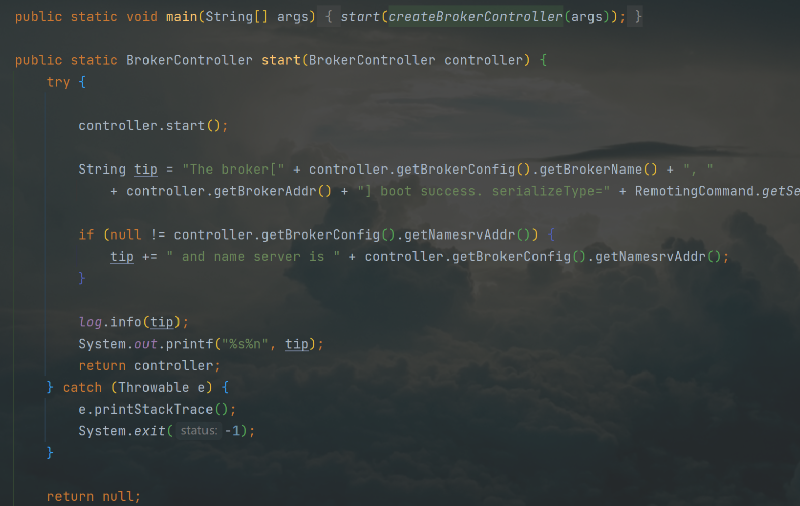

我们来到`BrokerController`中的构造方法中发现一行与Topic相关的代码，查看`enableLmq`参数发现其初始为false，然后自然就进入`TopicConfigManager`的构造方法

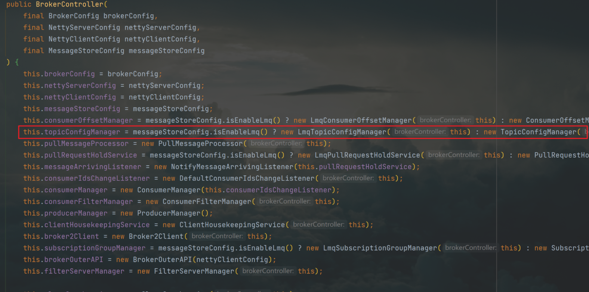

来到这个构造方法里面我们发现了熟悉的`TopicValidator.AUTO_CREATE_TOPIC_KEY_TOPIC`参数，在第二个代码块中如果`BrokerController`的`getBrokerConfig()`中的`isAutoCreateTopicEnable()` 参数为true的话，那么我们就从`TopicValidator.AUTO_CREATE_TOPIC_KEY_TOPIC`取出TBW102的那个Topic，然后把他加入`TopicConfig`,再把这个`defaultTopic`和`TopicConfig`放入`topicConfigTable`

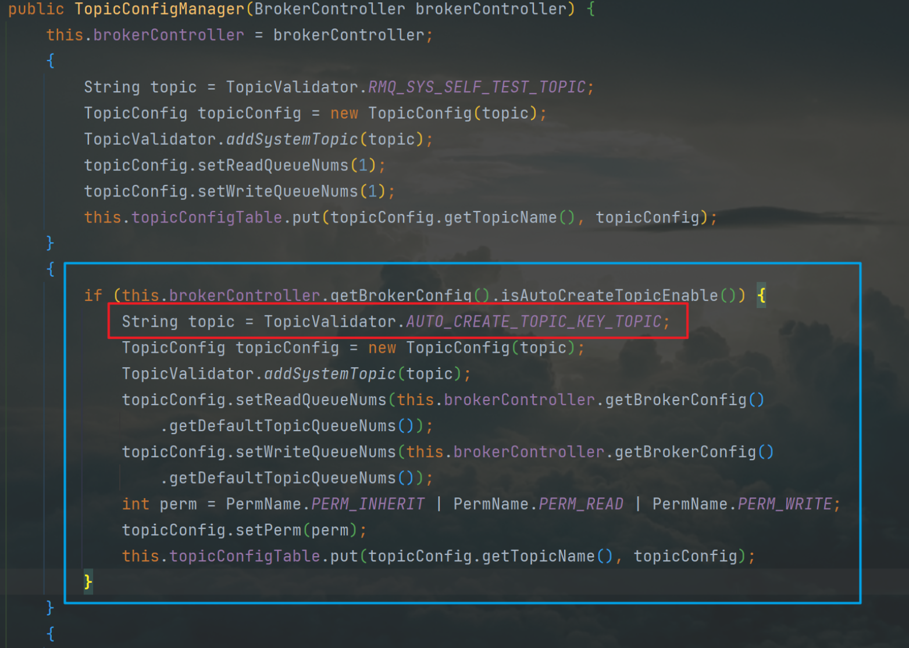

我们在broker端找到`TopicValidator.AUTO_CREATE_TOPIC_KEY_TOPIC`发现是在`createTopicInSendMessageMethod()`方法中进行了创建Topic，我们根据调用链一路往上寻找...

发现其实际流程是：

Netty网络层处理请求，然后调用到`msgCheck()`方法，在`msgCheck()`方法中检查到Topic不存在然后进行创建，然后给producer端一个返回，具体调用链如下：

#### 总结

​		没有手动创建Topic时，如果启动Broker时加了`AutoCreateTopicEnable = true`的参数，Producer发送一个不存在的Topic消息时，首先会调用`updateTopicRouteInfoFromNameServer()`方从`NameServer`拉取路由数据，第一次拉取必然失败；

第二次会直接拉取TBW102的路由数据，基于它创建`TopicPublishInfo`并存到本地map，进行正常的消息发送，在`requestHeader`里将`defaultTopic`设置为TBW102。Broker接收到消息时，先对消息做msgCheck，检查到Topic不存在，会基于`defaultTopic`的配置去创建该Topic，然后注册到`NameServer`上，这样一个全新的Topic就被自动创建了。

### 二、元数据的生命周期图

#### 服务端

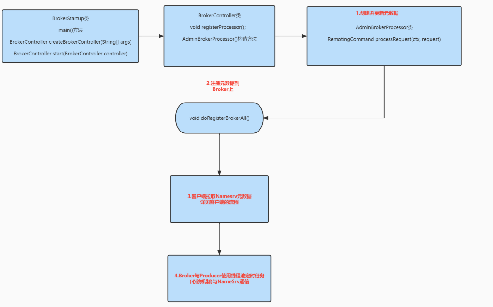

#### 客户端

Producer的send主流程：

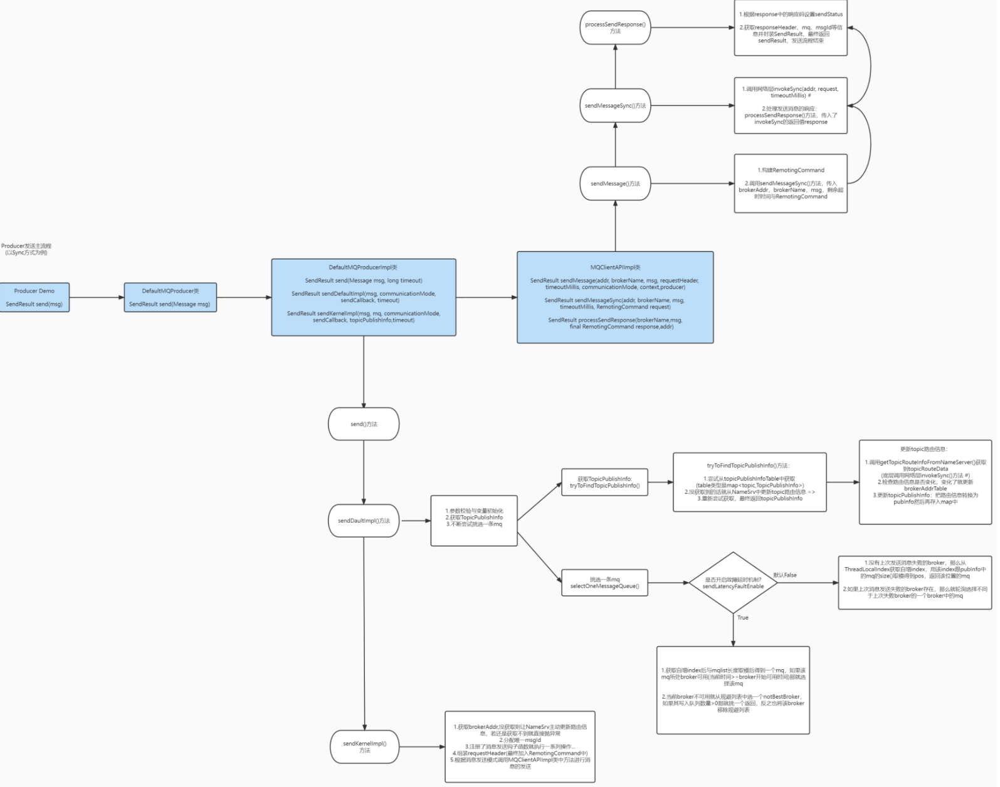

所以我们根据此梳理出客户端处理元数据的流程

1. 获取路由元数据

2. 线程池定时任务定时更新元数据

   

具体如下：

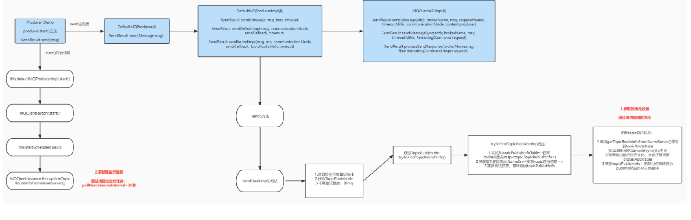

ps：对源码学习尚浅，如有错误请指出；另外...图画的很丑将就看

