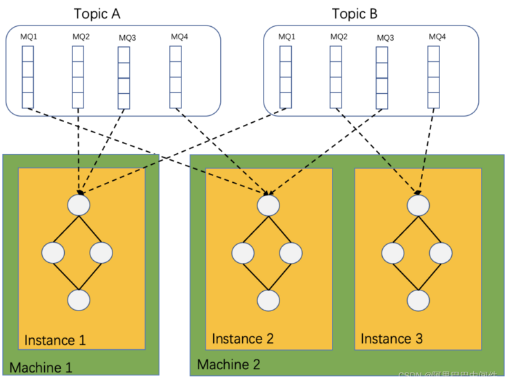
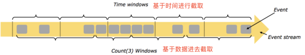
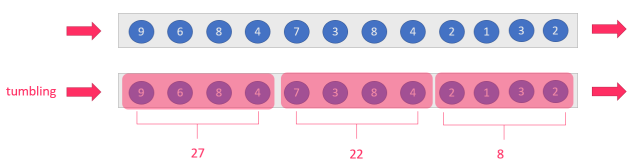
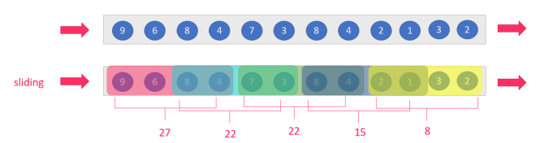

# 题目2：RocketMQ-streams Demo 开发


题目描述：目前RocketMQ-Streams不仅仅实现了多个算子，而且提供了强大的join，window 等能力，需要同学为相关的功能特性提供demo 帮助用户快速使用，包括：

1. 为不同功能点提供example。

2. 为所提供demo 的功能点提供文档讲解阐述该功能的使用方式以及阐述基础的实现逻辑。


## 1.RocketMQ-Streams介绍


​		RocketMQ-Streams 是一款轻量级流处理引擎，应用以SDK 的形式嵌入并启动，即可进行流处理计算，不依赖于其他组件，最低1核1G可部署，在资源敏感场景具有很大优势。同时它支持 UTF/UTAF/UTDF 多种计算类型。目前已经广泛运用于安全，风控，边缘计算等场景。


架构图：



RocketMQ-Streams 作为轻量流处理引擎，本质上是作为RocketMQ 的客户端消费数据，一个流处理实例可以处理多个队列，而一个队列只能被一个实例消费。若干RocketMQ-Streams 实例组成消费者组共同消费数据，通过扩容实例达到增加处理能力的消费，减少实例则会发生rebalance，消费的队列自动重平衡到其他消费实例上。从上述图中，我们还可以看出计算实例间不需要直接交换任何数据，可各自独立完成所有计算处理。这种架构简化了RocketMQ-Streams 本身的设计，同时也可非常方便的进行实例扩缩容。


## 2.RocketMQ-Streams API


### 2.1 Source

- `fromFile`: reads data from the file. This method contains two parameters:
  - `filePath`: specifies which file path to read. Required.
  - `isJsonData`: specifies whether data is in JSON format. Optional. Default value: `true`.
  - `tags`: the tags for filtering messages used by the RocketMQ consumer. Optional.
- `fromRocketmq`: obtains data from RocketMQ, including four parameters:
  - `topic`: the topic name of RocketMQ. Required.
  - `groupName`: the name of the consumer group. Required.
  - `isJson`: specifies whether data is in JSON format. Optional.
  - `tags`: the tags for filtering messages used by the RocketMQ consumer. Optional.
- `from`: custom data source. You can specify your own data source by implementing ISource interface.


### 2.2 transform

transform allows the input source data to be modified during the stream calculation process for the next step; DataStream API includes `DataStream`, `JoinStream`, `SplitStream`, `WindowStream`, and many other transform classes.


DataStream implements a series of common stream calculation operators as follows:

- `map`: returns a new DataStream by passing each record of the source to the **func** function.

- `flatmap`: similar to map. One input item corresponds to 0 or more output items.

- `filter`: returns a new DataStream based on the record of the source DataStream only when the ** func** function returns **true**.

- `forEach`: executes the **func** function once for each record and returns a new DataStream.

- `selectFields`: returns the corresponding field value for each record, and returns a new DataStream.

- `operate`: executes a custom function for each record and returns a new DataStream.

- `script`: executes a script for each recorded field, returns new fields, and generates a new DataStream.

- `toPrint`: prints the result on the console and generates a new DataStreamAction instance.

- `toFile`: saves the result as a file and generates a new DataStreamAction instance.

- `toDB`: saves the result to the database.

- `toRocketmq`: outputs the result to RocketMQ.

- `to`: outputs the result to the specified storage through the custom ISink interface.

- window: performs relevant statistical analysis in the window, generally used in conjunction with

    summary calculations in the window.

- join: associates the two streams or one stream and one physical table according to the conditions and merges them into a large stream for related calculations.

  - `dimJoin` associate a stream with a physical table which can be a file or a db table, and all matching records are retained
  - `dimLeftJoin` After a flow is associated with a physical table, all data of the flow is reserved and fields that do not match the physical table are left blank
  - `join`
  - `leftJoin`

- `union`: merges the two streams.

- `split`: splits a data stream into different data streams according to tags for downstream analysis and calculation.

- `with`: specifies related strategies during the calculation, including Checkpoint and state storage strategies, etc.


### 2.3 Sink

- `toFile`: write result to file
- `toMqtt`: write result to mq
- `toPrint`: print to console


## 3.RocketMQ-Streams使用示例


### 3.1 基本Demo

```css
public class RocketMQWindowExample {
    public static void main(String[] args) {
        DataStreamSource source = StreamBuilder.dataStream("namespace", "pipeline");
        source.fromRocketmq(
                "topicName",
                "groupName",
                false,
                "namesrvAddr")
                .map(message -> JSONObject.parseObject((String) message))
                .window(TumblingWindow.of(Time.seconds(10)))
                .groupBy("groupByKey")
                .sum("字段名", "输出别名")
                .count("total")
                .waterMark(5)
                .setLocalStorageOnly(true)
                .toDataSteam()
                .toPrint(1)
                .start();
    }
}
```

pom文件依赖：

```css
<dependency>
  <groupId>org.apache.rocketmq</groupId>
  <artifactId>rocketmq-streams-clients</artifactId>
  <version>1.0.1-preview</version>
</dependency>
```


​		上述代码是一个简单的使用例子，它主要的功能是从RocketMQ中指定topic读取数据，经过转化成JSON格式，以groupByKey字段值分组、10秒一个窗口，对OutFlow字段值进行累加，结果输出到total字段，并打印到控制台上。上述计算中还允许输入乱序5秒，即窗口时间到达后不会马上触发，而是会等待5s，如果这个段时间内，有窗口数据到达依然有效。上述setLocalStorageOnly为true表示不对状态进行远程存储，仅使用RocksDB做本地存储。


### 3.2 Source


#### 3.2.1 读文件

```java
import com.alibaba.fastjson.JSONPObject;
import com.google.gson.JsonObject;
import org.apache.rocketmq.streams.client.StreamBuilder;
import org.apache.rocketmq.streams.client.source.DataStreamSource;
import org.apache.rocketmq.streams.common.functions.FilterFunction;
import org.json.JSONObject;

public class FileSourceExample {
    private static final Integer INFLOW_THRESHOLD = 4;
    private static final String REQUIRED_LOG_STORE = "LogStore-1";

    public static void main(String[] args) {
        DataStreamSource source = StreamBuilder.dataStream("namespace", "pipeline");
        source.fromFile("data.txt", true)
            .map(message -> message)
            .toFile("result.txt")
            .start();
    }
}
```

​		source为数据源接口，上述代码使用`fromFile`方法从File中读取数据源，然后使用map转换数据类型，最终输出到`result.txt`这个文件中。


```java
public class FileSourceExample2 {
    private static final Integer INFLOW_THRESHOLD = 4;
    private static final String REQUIRED_LOG_STORE = "LogStore-1";

    public static void main(String[] args) {
        DataStreamSource source = StreamBuilder.dataStream("namespace", "pipeline");

        source.fromFile("data.txt", true)
            .map(message -> message)
                .filter(new FilterFunction<JSONObject>() {
                    @Override
                    public boolean filter(JSONObject value) throws Exception {
                        return value.getInteger("InFlow") > INFLOW_THRESHOLD
                                && REQUIRED_LOG_STORE.equals(value.getString("LogStore"));
                    }
                })
            .toPrint()
            .start();
    }
}
```

上述代码在基础读文件逻辑上加入filter方法，采用Lambda表达式的形式对数据进行过滤。


#### 3.2.2 读消息队列


```java
public class MqttSourceExample {

    public static void main(String[] args) {
        DataStreamSource dataStream = StreamBuilder.dataStream("test_namespace", "graph_pipeline");
        dataStream.fromMqtt("xxxxx", "xxxx", "xxxxxx", "", "")
            .flatMap(message -> ((JSONObject) message).getJSONArray("Data"))
            .window(TumblingWindow.of(Time.minutes(1)))
            .groupBy("AttributeCode")
            .setLocalStorageOnly(true)
            .avg("Value", "avg_value")
            .toDataSteam()
            .toPrint()
            .with(ShuffleStrategy.shuffleWithMemory())
            .start();
    }

}
```

上述代码使用`fromMqtt`方法对接从mq采集过来的数据源，把读文件改为实时的流式处理。


```java
public class RocketmqSourceExample1 {
    public static void main(String[] args) {
        ProducerFromFile.produce("data.txt",NAMESRV_ADDRESS, RMQ_TOPIC);

        try {
            Thread.sleep(1000 * 3);
        } catch (InterruptedException e) {
        }

        System.out.println("begin streams code.");

        DataStreamSource source = StreamBuilder.dataStream("namespace", "pipeline");
        /**
         * 1、before run this case, make sure some data has already been rocketmq.
         */
        source.fromRocketmq(
                RMQ_TOPIC,
                RMQ_CONSUMER_GROUP_NAME,
                NAMESRV_ADDRESS
        )
                .map(message -> message)
                .toPrint(1)
                .start();

    }
```

上述代码使用`fromRocketmq`专门读取来自RocketMQ数据源的流式数据。


### 3.3 Transform

transform作用是对数据进行具体的处理，包括转换数据格式，过滤，流操作，窗口函数等一系列丰富操作。


#### 3.3.1 Map类

map类的作用是转换数据类型，这里有map和flatMap两种方法


Map算子：输入一个元素，然后返回一个元素，中间可以进行清洗转换等操作，一对一转换，即一条转换成另外一条 

FlatMap：输入一个元素，可以返回0个/1个或多个元素。


```java
source.fromFile("data.txt", true)
            .map(message -> message)
```


```java
        dataStream.fromMqtt("xxxxx", "xxxx", "xxxxxx", "", "")
            .flatMap(message -> ((JSONObject) message).getJSONArray("Data"))
```


#### 3.3.2 Window类

```java
public class RocketMQWindowExample {

    /**
     * 1、make sure your rocketmq server has been started.
     * 2、rocketmq allow create topic automatically.
     */
    public static void main(String[] args) {
        ProducerFromFile.produce("data.txt",NAMESRV_ADDRESS, RMQ_TOPIC);

        try {
            Thread.sleep(1000 * 3);
        } catch (InterruptedException e) {
        }
        System.out.println("begin streams code.");

        DataStreamSource source = StreamBuilder.dataStream("namespace", "pipeline");
        source.fromRocketmq(
                RMQ_TOPIC,
                RMQ_CONSUMER_GROUP_NAME,
                false,
                NAMESRV_ADDRESS)
                .filter((message) -> {
                    try {
                        JSONObject.parseObject((String) message);
                    } catch (Throwable t) {
                        // if can not convert to json, discard it.because all operator are base on json.
                        return false;
                    }
                    return true;
                })
                //must convert message to json.
                .map(message -> JSONObject.parseObject((String) message))
                .window(TumblingWindow.of(Time.seconds(10)))
                .groupBy("ProjectName","LogStore")
                .sum("OutFlow", "OutFlow")
                .sum("InFlow", "InFlow")
                .count("total")
                .waterMark(5)
                .setLocalStorageOnly(true)
                .toDataSteam()
                .toPrint(1)
                .with(WindowStrategy.highPerformance())
                .start();

    }

}
```

window的作用是对于无界的流式数据按时间长度或者数据量分为一个个窗口，方便对数据进行实时的处理和计算，使用window方法进行操作。


##### Window的分类


**按照time和count分类**

**time-window**:时间窗口:根据时间划分窗口,如:每xx分钟统计最近xx分钟的数据

**count-window**:数量窗口:根据数量划分窗口,如:每xx个数据统计最近xx个数据




**按照slide和size分类**

窗口有两个重要的属性: 窗口大小size和滑动间隔slide,根据它们的大小关系可分为:

**tumbling-window**:滚动窗口:size=slide,如:每隔10s统计最近10s的数据



**sliding-window**:滑动窗口:size>slide,如:每隔5s统计最近10s数据



**注意**:当`size<slide`的时候,如每隔15s统计最近10s的数据,那么中间5s


**小结**

按照上面窗口的分类方式进行组合,可以得出如下的窗口:

1. 基于时间的滚动窗口tumbling-time-window--**用的较多**
2. 基于时间的滑动窗口sliding-time-window--**用的较多**
3. 基于数量的滚动窗口tumbling-count-window--用的较少
4. 基于数量的滑动窗口sliding-count-window--用的较少


RocketMQ-Streams还支持一个特殊的窗口:`Session`会话窗口,需要设置一个会话超时时间,如30s,则表示30s内没有数据到来,则触发上个窗口的计算


#### 3.3.3 Join类


Join方法是进行合流和分流操作，可以给流打上标签，将两个不同数据源的流合并。

```java
public class RocketmqJoinExample {
    public static void main(String[] args) {
        DataStream left = StreamBuilder.dataStream("tmp", "tmp")
            .fromRocketmq("TopicTest", "groupA", true, "localhost:9876");
        DataStream right = StreamBuilder.dataStream("tmp", "tmp")
            .fromRocketmq("TopicTest", "groupB", true, "localhost:9876");

        left.join(right)
            .on("(ProjectName,=,ProjectName)")
            .toDataSteam()
            .toPrint()
            .start();
    }

}
```


### 3.4 Sink

Sink是RocketMQ-Streams输出结果的逻辑，可以输出到控制台，文件，消息队列，数据库等等


```java
public class MqttSinkExample {

    public static void main(String[] args) {
        DataStreamSource source = StreamBuilder.dataStream("namespace", "pipeline");
        source.fromFile("/Users/junjie.cheng/jobs/access.log", false)
            .map(message -> message)
            .toMqtt("tpc://localhost:1883", "test", "test")
            .start();
    }

}
```

上述代码使用`toMqtt`方法将流处理的结果输出到`localhost:1883`地址的消息队列


## 4.总结

​		

​		RocketMQ-Streams通过Source-> Transform -> Sink 三个主要过程，对流式数据进行丰富且精准的处理，还提供checkpoint等机制，对于数据进行有效备份。

​		RocketMQ-Streams适合大数据量 ->高过滤 ->轻窗口计算的场景。不同于主流计算引擎，需要先部署集群，写任务，发布，调优，运行这么复杂的过程。RocketMQ-Streams 本身就是一个 lib 包，基于 SDK 写完流任务，可以直接运行。支持大数据开发需要的计算特性：Exactly-ONCE，灵活窗口（滚动、滑动、会话），双流Join，高吞吐、低延迟、高性能。

​		