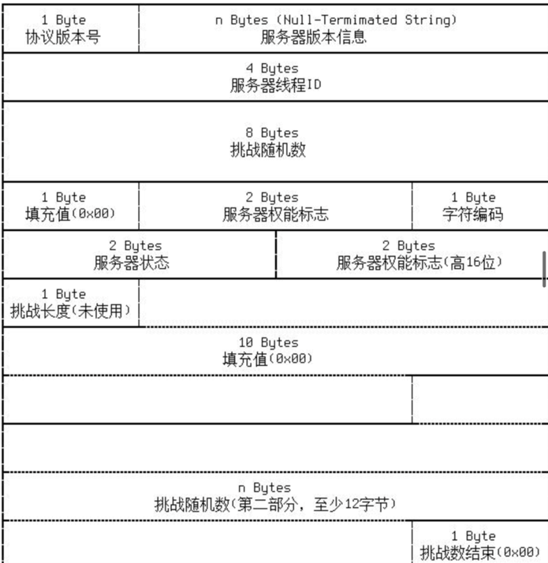

# Nacos能力协商机制设计方案

## 概述

### 理解能力协商

能力协商即节点之间对于所支持的功能的确认（客户端与服务端、服务端与服务端），其中涉及了两个关键点：节点之间的通信机制、功能的数据模型

首先需要明晰Nacos中客户端与服务端、服务端与服务端之间的通信机制，因为能力协商应该是作为通信过程中的前置部分，TCP连接建立后，节点之间先进行能力协商，确认了相互之间所支持的功能，再进行具体的数据传输。

其次需要对于功能这个概念建立一个可量化的数学模型，有哪些功能点需要进行协商，在通信机制中如何优雅的加入功能的协商，而且这个数据模型应该是可以扩展的，易于维护的。

### Nacos原有机制分析

Nacos原有的能力协商机制较为简单，只是针对版本进行了校验判断。

能力协商机制是基于节点之间的通信机制实现的，Nacos的通信机制基于Netty实现

Nacos2.0后采用了grpc作为长连接的实现，RequestMetaData中包含版本等字段

```java
public class RequestMeta {

    private String connectionId = "";

    private String clientIp = "";

    private String clientVersion = "";

    private Map<String, String> labels = new HashMap<String, String>();
}

```

以客户端与服务端的通信为例，针对不同的请求类型，会有不同的RequestHandler去处理，同时会有filter去过滤到不合法的请求

```java
public abstract class RequestHandler<T extends Request, S extends Response> {

    @Autowired
    private RequestFilters requestFilters;

/**
     * Handler request.
     *
     *@paramrequestrequest
     *@parammetarequest meta data
     *@returnresponse
     *@throwsNacosException nacos exception when handle request has problem.
     */
public Response handleRequest(T request, RequestMeta meta) throws NacosException {
        for (AbstractRequestFilter filter : requestFilters.filters) {
            try {
                Response filterResult = filter.filter(request, meta, this.getClass());
                if (filterResult != null && !filterResult.isSuccess()) {
                    return filterResult;
                }
            } catch (Throwable throwable) {
                Loggers.REMOTE.error("filter error", throwable);
            }

        }
        return handle(request, meta);
    }

/**
     * Handler request.
     *
     *@paramrequestrequest
     *@parammetarequest meta data
     *@returnresponse
     *@throwsNacosException nacos exception when handle request has problem.
     */
public abstract S handle(T request, RequestMeta meta) throws NacosException;

}

```

例如：利用GrpcRequestFilter对不支持grpc的节点收到grpc请求的场景进行过滤。

```java
@Component
public class GrpcRequestFilter extends AbstractRequestFilter {

    @Autowired
    private UpgradeJudgement upgradeJudgement;

    @Override
    protected Response filter(Request request, RequestMeta meta, Class handlerClazz) throws NacosException {
        if (request instanceof AbstractNamingRequest && !upgradeJudgement.isUseGrpcFeatures()) {
            Response response = getDefaultResponseInstance(handlerClazz);
            response.setErrorInfo(NacosException.SERVER_ERROR,
                    "Nacos cluster is running with 1.X mode, can't accept gRPC request temporarily. Please check the server status or close Double write to force open 2.0 mode. Detail https://nacos.io/en-us/docs/2.0.0-upgrading.html.");
            return response;
        }
        return null;
    }
}
```

除此之外注意到Nacos中存在着基础能力的设计ClientAbilities和ServerAbilities，对Client和Server的远程通信能力、配置能力、服务能力进行描述与控制，Client和Server初始化时会对这些能力进行初始化。

```java
public class ServerAbilities implements Serializable {

    private static final longserialVersionUID= -2120543002911304171L;

    private ServerRemoteAbility remoteAbility = new ServerRemoteAbility();

    private ServerConfigAbility configAbility = new ServerConfigAbility();

    private ServerNamingAbility namingAbility = new ServerNamingAbility();
}

public class ClientAbilities implements Serializable {
    
    private static final long serialVersionUID = -3590789441404549261L;
    
    private ClientRemoteAbility remoteAbility = new ClientRemoteAbility();
    
    private ClientConfigAbility configAbility = new ClientConfigAbility();
    
    private ClientNamingAbility namingAbility = new ClientNamingAbility();
}
```

这些能力描述粒度较粗，且可扩展性不足

## 其它产品的参考

### Mysql

**设计概要**

mysql的客户端与服务端在初次进行连接时，TCP连接建立后会有一个握手认证的阶段，这个阶段分为两个部分

- 服务端向客户端发送一个握手初始化报文
- 客户端向服务端发送登陆认证报文

握手认证阶段中服务端和客户端会通过报文中的权能标识来进行能力协商，客户端收到服务器发来的初始化报文后，会对服务器发送的权能标志进行修改，保留自身所支持的功能，然后将权能标识返回给服务器，从而保证服务器与客户端通讯的兼容性

**设计实现**

Mysql握手认证流程


MySQL在客户端和服务器分别使用一个位域来保存各自支持的能力，每一位为1表示支持该位对应的能力，为0则表示不支持

在握手阶段，服务器先通过MySQL:Protocol::Handshake报文向客户端发送自己支持的能力，


客户端通过MySQL:Protocol::HandshakeResponse报文返回自己支持的能力。


双方均会保存对方的能力标识位域，在判断对方是否支持某种能力时，只需要将这个值和需要判断的能力标识位域进行逐位与运算，如果不为0则表示支持该种能力。

### Kafka

**设计概要**

客户端与服务端进行通信时，在建立socket连接后会先进行版本协商，通过版本协商来保证客户端和服务端版本兼容的。

Kafka保证的兼容策略是 *bidirectional compatibility，*新版本客户端可以访问旧版本的 broker；新版本 broker 可以接受旧版本的客户端的请求。

客户端在连接上 Broker 并实际开始工作之前，发送ApiVersionRequest请求到每个 Broker，以查询 Broker 支持的 版本列表，并从中选取一个它能识别的最高版本作为后续使用版本。

这个版本协商是基于连接的：每次连接断开并重连时，都要重新进行版本协商。因为断线可能正是因为Broker升级导致的。

**设计实现**

以客户端与broker的交互为例

NetworkClient管理客户端的所有连接，其中维护着与能力协商相关的字段

```java
//当首次连接broker需要版本协商时为true（默认为true）
private final boolean discoverBrokerVersions;
//维护该client所连接的外部节点的api版本
private final ApiVersions apiVersions;
//需要进行api版本获取的外部节点集合
private final Map<String, ApiVersionsRequest.Builder> nodesNeedingApiVersionsFetch = new HashMap<>();
```

ApiVersions类维护着一个key为节点id，value为NodeApiVersions的map，借此来对client所连接的外部节点的api版本进行维护

```java
public class ApiVersions {

    private final Map<String, NodeApiVersions> nodeApiVersions = new HashMap<>();
    private byte maxUsableProduceMagic = RecordBatch.CURRENT_MAGIC_VALUE;

    public synchronized void update(String nodeId, NodeApiVersions nodeApiVersions) {
        this.nodeApiVersions.put(nodeId, nodeApiVersions);
        this.maxUsableProduceMagic = computeMaxUsableProduceMagic();
    }

    public synchronized void remove(String nodeId) {
        this.nodeApiVersions.remove(nodeId);
        this.maxUsableProduceMagic = computeMaxUsableProduceMagic();
    }

    public synchronized NodeApiVersions get(String nodeId) {
        return this.nodeApiVersions.get(nodeId);
    }

    private byte computeMaxUsableProduceMagic() {
        // use a magic version which is supported by all brokers to reduce the chance that
        // we will need to convert the messages when they are ready to be sent.
    }

    public synchronized byte maxUsableProduceMagic() {
        return maxUsableProduceMagic;
    }

}

```

NodeApiVersions对ApiKeys以及其支持的版本进行映射记录，ApiKeys是一个枚举类，代表着kafka支持的所有api，即所谓的能力，而ApiVersion即为标识

```java
		// A map of the usable versions of each API, keyed by the ApiKeys instance
    private final Map<ApiKeys, ApiVersion> supportedVersions = new EnumMap<>(ApiKeys.class);

    // List of APIs which the broker supports, but which are unknown to the client
    private final List<ApiVersion> unknownApis = new ArrayList<>();

    private final Map<String, SupportedVersionRange> supportedFeatures;
```

socket连接建立后，如果设置了版本协商机制可用（默认），会调用handleConnections方法对所有已经建立了socket连接的远程节点构造ApiVersionsRequest

```java
private void handleConnections() {
    for (String node : this.selector.connected()) {
        if (discoverBrokerVersions) {
				//已经建立连接的需要获取api版本的节点构造ApiVersionsRequest
            nodesNeedingApiVersionsFetch.put(node, new ApiVersionsRequest.Builder());
            log.debug("Completed connection to node {}. Fetching API versions.", node);
        } else {
            this.connectionStates.ready(node);
            log.debug("Completed connection to node {}. Ready.", node);
        }
    }
}
```

之后会调用handleInitialApiVersionRequests方法来发送版本协商请求，调用handleApiVersionsResponse方法来处理版本协商的响应

```java
private void handleInitiateApiVersionRequests(long now) {
    Iterator<Map.Entry<String, ApiVersionsRequest.Builder>> iter = nodesNeedingApiVersionsFetch.entrySet().iterator();
//遍历需要版本协商的节点
    while (iter.hasNext()) {
        Map.Entry<String, ApiVersionsRequest.Builder> entry = iter.next();
        String node = entry.getKey();
        if (selector.isChannelReady(node) && inFlightRequests.canSendMore(node)) {
            log.debug("Initiating API versions fetch from node {}.", node);
						//更新连接的状态为版本协商状态
            this.connectionStates.checkingApiVersions(node);
            ApiVersionsRequest.Builder apiVersionRequestBuilder = entry.getValue();
            ClientRequest clientRequest = newClientRequest(node, apiVersionRequestBuilder, now, true);
						//发送版本协商request
            doSend(clientRequest, true, now);
            iter.remove();
        }
    }
}
```

```java
private void handleApiVersionsResponse(List<ClientResponse> responses,
                                       InFlightRequest req, long now, ApiVersionsResponse apiVersionsResponse) {
    final String node = req.destination;
	//判断响应和版本是否符合要求
    if (apiVersionsResponse.data().errorCode() != Errors.NONE.code()) {
        if (req.request.version() == 0 || apiVersionsResponse.data().errorCode() != Errors.UNSUPPORTED_VERSION.code()) {
            log.warn("Received error {} from node {} when making an ApiVersionsRequest with correlation id {}. Disconnecting.",
                    Errors.forCode(apiVersionsResponse.data().errorCode()), node, req.header.correlationId());
            this.selector.close(node);
            processDisconnection(responses, node, now, ChannelState.LOCAL_CLOSE);
        } else {
				//对符合要求的响应，得到最大的版本
            short maxApiVersion = 0;
            if (apiVersionsResponse.data().apiKeys().size() > 0) {
                ApiVersion apiVersion = apiVersionsResponse.data().apiKeys().find(ApiKeys.API_VERSIONS.id);
                if (apiVersion != null) {
                    maxApiVersion = apiVersion.maxVersion();
                }
            }
            nodesNeedingApiVersionsFetch.put(node, new ApiVersionsRequest.Builder(maxApiVersion));
        }
        return;
    }

//如果符合要求则更新该节点的版本缓存，并更新该连接的状态为ready
    NodeApiVersions nodeVersionInfo = new NodeApiVersions(
        apiVersionsResponse.data().apiKeys(),
        apiVersionsResponse.data().supportedFeatures());
    apiVersions.update(node, nodeVersionInfo);
    this.connectionStates.ready(node);
    log.debug("Node {} has finalized features epoch: {}, finalized features: {}, supported features: {}, API versions: {}.",
            node, apiVersionsResponse.data().finalizedFeaturesEpoch(), apiVersionsResponse.data().finalizedFeatures(),
            apiVersionsResponse.data().supportedFeatures(), nodeVersionInfo);
}
```

doSend方法进行具体的请求发送

```java
private void doSend(ClientRequest clientRequest, boolean isInternalRequest, long now) {
    ensureActive();
    String nodeId = clientRequest.destination();
    if (!isInternalRequest) {
        if (!canSendRequest(nodeId, now))
            throw new IllegalStateException("Attempt to send a request to node " + nodeId + " which is not ready.");
    }
    AbstractRequest.Builder<?> builder = clientRequest.requestBuilder();
    try {
        NodeApiVersions versionInfo = apiVersions.get(nodeId);
				//得到该request的builder的最新版本
        short version;
        if (versionInfo == null) {
            version = builder.latestAllowedVersion();
            if (discoverBrokerVersions && log.isTraceEnabled())
                log.trace("No version information found when sending {} with correlation id {} to node {}. " +
                        "Assuming version {}.", clientRequest.apiKey(), clientRequest.correlationId(), nodeId, version);
        } else {
            version = versionInfo.latestUsableVersion(clientRequest.apiKey(), builder.oldestAllowedVersion(),
                    builder.latestAllowedVersion());
        }
					//发送请求
        doSend(clientRequest, isInternalRequest, now, builder.build(version));
    } catch (UnsupportedVersionException unsupportedVersionException) {
			//版本不支持异常处理
        log.debug("Version mismatch when attempting to send {} with correlation id {} to {}", builder,
                clientRequest.correlationId(), clientRequest.destination(), unsupportedVersionException);
        ClientResponse clientResponse = new ClientResponse(clientRequest.makeHeader(builder.latestAllowedVersion()),
                clientRequest.callback(), clientRequest.destination(), now, now,
                false, unsupportedVersionException, null, null);

        if (!isInternalRequest)
            abortedSends.add(clientResponse);
        else if (clientRequest.apiKey() == ApiKeys.METADATA)
            metadataUpdater.handleFailedRequest(now, Optional.of(unsupportedVersionException));
    }
}
```

整个通信流程如下图所示


**设计总结**

Kafka利用一个枚举类对所有的API进行了标识，描述了所谓“能力”，并用ApiVersion对其进行了量化

节点本身会维护其所连接的远程节点的能力信息（即所支持的Api及其版本）

连接一个节点时会与该节点进行能力协商，会依次对其每一个API进行版本校验，如果其中某个Api的版本该节点不支持，就会抛出UnsupportedVersionException

能力协商过程是节点通信的子过程，其完成与否会对该连接的状态产生影响

## 方案设计

### 设计思想

综合Mysql和Kafka的能力协商机制设计，并考虑到Nacos的通信流程，决定将Nacos的能力协商机制设计成为用所支持的Api及其版本进行能力量化、并在整个连接过程中的适当节点对这些Api进行版本校验的过程

### 方案简述

能力标识：参考Kafka的实现，将能力具像化为Nacos支持的API，对能力的衡量具像化为该API所支持的版本。

每个节点初始化时会用一个map维护自己的能力信息：所支持的API以及对应的最高版本

协商流程：（以客户端与服务端的能力协商为例）

- 当客户端初次连接一个服务端节点时，相互会缓存对方的能力信息（所支持的API及版本），由于双方保持着长连接，定时会向对方发送更新后的能力信息（如果未发生变化则返回为未变化的标识即可），并检查更新后的能力信息是否满足要求
- 根据具体的连接类型进行针对性的能力协商，校验在该连接类型中需要提供的API的版本是否满足条件
- 能力协商通过后（如果开启能力协商机制的话），才能进行具体的内容传输，不通过则抛出能力协商失败异常

### 关键设计

1.能力模型的设计

参考kafka

对Nacos中的API进行枚举，每个API都会有多个版本号

每个节点的能力信息即其所支持的所有API及该API所支持的最新版本号到最老版本号

2.能力协商机制嵌套至原有的通信模型中

节点连接状态增加能力协商状态；两个节点建立连接时，当TCP连接建立后，首先进行能力协商通信，能力协商通过后，该连接的状态从能力协商状态转换为可发送数据状态

首次和另外一个节点进行连接建立时需要进行能力协商，当连接建立后将与本节点通信的节点的能力信息进行缓存，当与某节点的连接断开后，将该节点的能力信息从本地清空

3.能力协商通信的具体内容

能力协商通信应建立在本次请求的连接类型的基础上，因为不同的请求类型所需要的API及其版本也是不同的。

能力协商通信时的内容，除了节点本身的元数据外，还应包含请求类型、节点能力信息,  proto大致如下

```java
message abilityRequest{
	String requestId;
	String requestType;
	map<Api, Version> abilities; 
}

message abilityResponse{
	String requestId;
	String responseCode;
}

service Ability{
	rpc ability (abilityRequest) returns (abilityResponse) {};
}
```

发起连接的节点发送能力协商request，接收的节点根据请求类型和两者能力信息，判断该请求的能力协商是否成功

能力协商失败则返回能力不匹配异常，成功则可开始具体通信。