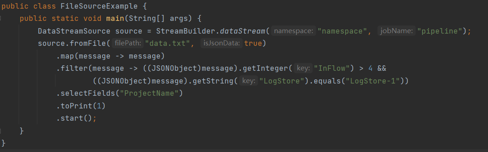

### 基于代码实例FileSourceExample以及data数据源打印出inflow大于4且LogStore为LogStore-1的projectname
代码：
```Java
public class FileSourceExample {
    public static void main(String[] args) {
        DataStreamSource source = StreamBuilder.dataStream("namespace", "pipeline");
        source.fromFile("data.txt", true)
            .map(message -> message)
            .filter(message -> ((JSONObject)message).getInteger("InFlow") > 4 &&
                    ((JSONObject)message).getString("LogStore").equals("LogStore-1"))
            .selectFields("ProjectName")
            .toPrint(1)
            .start();
    }
}
```
结果：

### 思考题
Q：如果消息处理需要基于事件时间进行处理，那么对于乱序的消息窗口需要添加什么额外的设计  
A：假设消息最长的传播时间为T，应该将窗口的时间扩大T，按照消息的时间戳筛选出窗口内发送的消息，并对消息进行排序