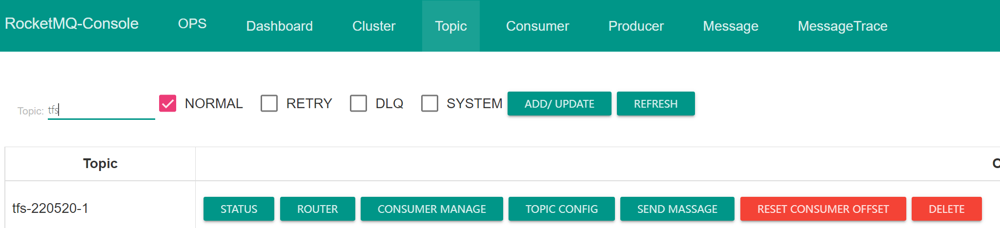
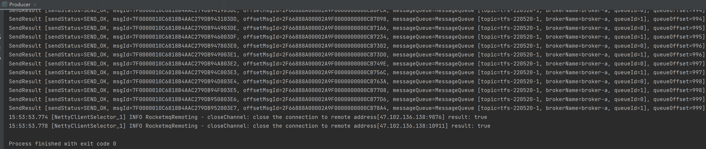
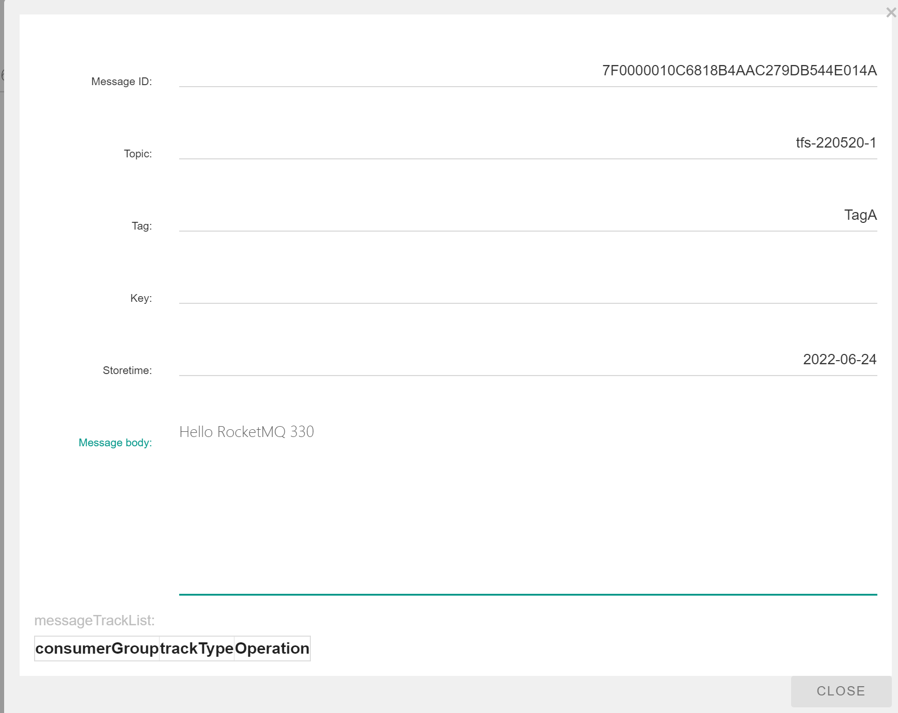

#### 把 example ( `org.apache.rocketmq.example.quickstart.Producer` ) 跑起来，能在 dashboard 中查到自己发送的消息

##### 1. 创建 topic




##### 2. 修改 `quickstart.Producer` 中的相关代码并执行

```java
public class Producer {
    public static void main(String[] args) throws MQClientException, InterruptedException {

        DefaultMQProducer producer = new DefaultMQProducer("please_rename_unique_group_name");

        producer.setNamesrvAddr("47.102.136.138:9876");
        producer.start();

        for (int i = 0; i < 1000; i++) {
            try {
                Message msg = new Message("tfs-220520-1", "TagA", ("Hello RocketMQ " + i).getBytes(RemotingHelper.DEFAULT_CHARSET));
                SendResult sendResult = producer.send(msg);
                System.out.printf("%s%n", sendResult);
            } catch (Exception e) {
                e.printStackTrace();
                Thread.sleep(1000);
            }
        }

        producer.shutdown();
    }
}
```


##### 3. 执行结果




##### 4. 在 dashboard 中查询自己发送的消息



