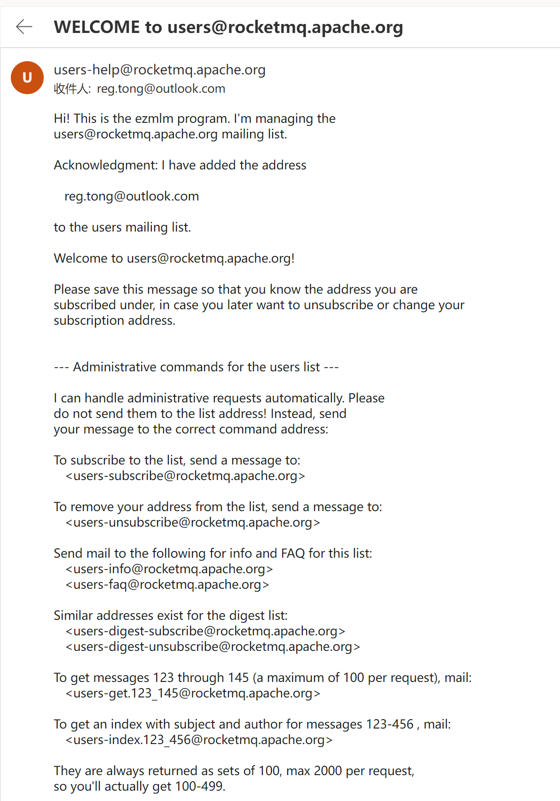
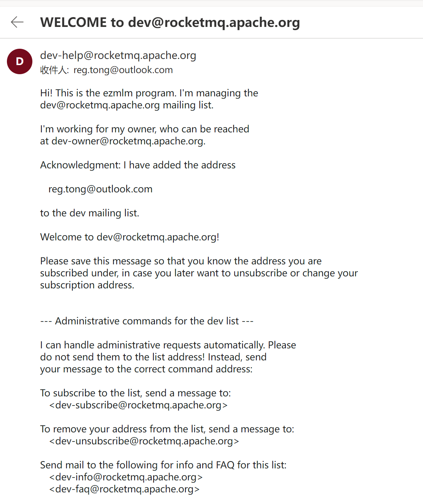

#### 一、订阅邮件

##### 1. 订阅 user

##### 2. 订阅 dev

#### 二、提交 pr

pr 提交的比较迟，是我在后期学习 `rocketmq-streams` 相关内容时，发现有个别单词拼写错误。

点击查看 [issue](https://github.com/apache/rocketmq-streams/issues/175) 和 [pr](https://github.com/apache/rocketmq-streams/pull/176) 。