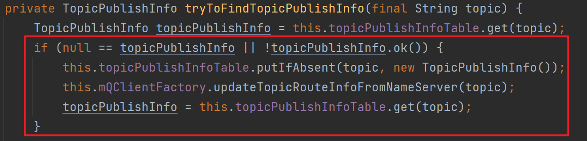
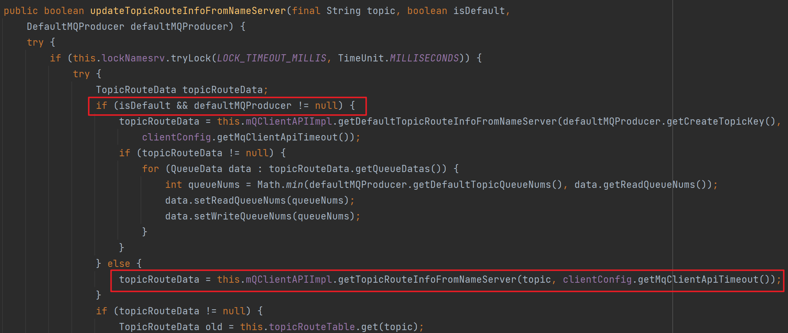
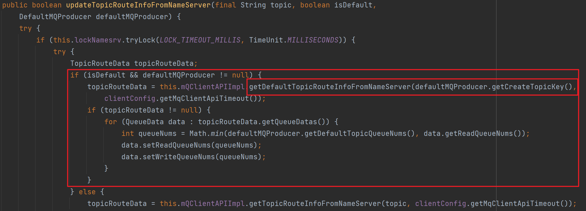
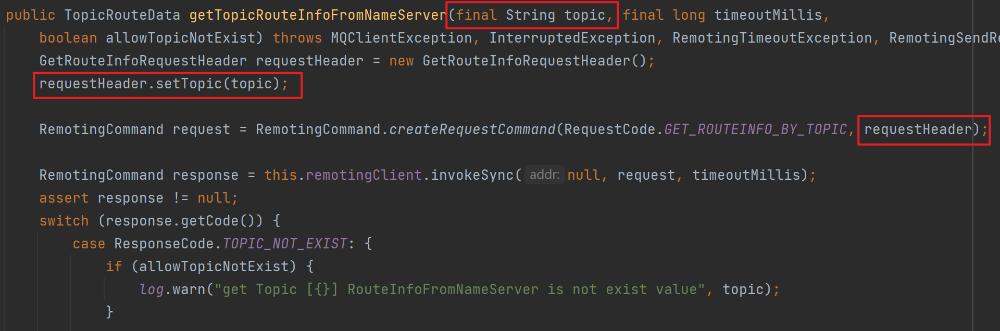
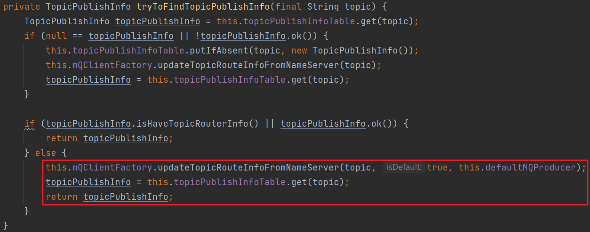
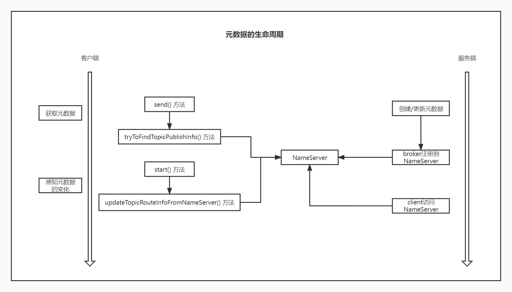

#### 一、为什么 Demo 里面没有创建 Topic，却可以使用？

1. 以 `example.quickstart.Producer` 为入口，去观察消息的发送流程。在 `rocketmq.client.impl.producer.DefaultMQProducerImpl` 的 `sendDefaultImpl()` 方法中，调用了 `tryToFindTopicPublishInfo(msg.getTopic())` 这个方法。那么如果对应的 Topic 不存在，应该是在这个方法中进行处理的。

2. 进入 `tryToFindTopicPublishInfo(msg.getTopic())` 方法。调用 `topicPublishInfoTable.get(topic)` 方法时，返回值为 `null`，进入如下 `if` 语句。

   

3. 这时会创建一个新的 `TopicPublishInfo`，并执行 `mQClientFactory.updateTopicRouteInfoFromNameServer(topic)` 方法，进一步会执行 `updateTopicRouteInfoFromNameServer(topic, false, null)` 方法。在执行如下所示的方法时，抛出 `MQClientException` 异常并被上一层捕捉。
   

4. 接着继续执行如下代码。

   

   进入 `mQClientFactory.updateTopicRouteInfoFromNameServer(topic, true, this.defaultMQProducer)` 内。

5. 此时 `isDefault` 为 `true`，`defaultMQProducer` 不为 `null`，并且 `defaultMQProducer.getCreateTopicKey()` 的值为 `TopicValidator.AUTO_CREATE_TOPIC_KEY_TOPIC`，也就是 `"TBW102"`。
   

6. 再往下走。

   
   可以得到一个 Topic 为 `"TBW102"` 的 `TopicRouteData`。
   再回到之前的代码。

   
   最后就得到了 Topic 为 `"TBW102"` 的 `TopicPublishInfo` 作为原先不存在的 Topic 的 `TopicPublishInfo`。

#### 二、画一下元数据的生命周期图

