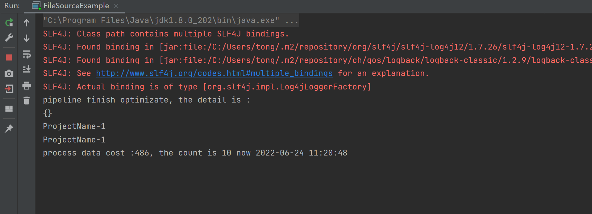

#### 编程题：基于代码实例 `FileSourceExample` 以及 `data数据源` 打印出 `Inflow` 大于 4 且 `LogStore` 为 `LogStore-1` 的 `ProjectName` 。

`data` 数据源：

```
{"InFlow":"1","ProjectName":"ProjectName-0","LogStore":"LogStore-0","OutFlow":"0"}
{"InFlow":"2","ProjectName":"ProjectName-1","LogStore":"LogStore-1","OutFlow":"1"}
{"InFlow":"3","ProjectName":"ProjectName-2","LogStore":"LogStore-2","OutFlow":"2"}
{"InFlow":"4","ProjectName":"ProjectName-0","LogStore":"LogStore-0","OutFlow":"3"}
{"InFlow":"5","ProjectName":"ProjectName-1","LogStore":"LogStore-1","OutFlow":"4"}
{"InFlow":"6","ProjectName":"ProjectName-2","LogStore":"LogStore-2","OutFlow":"5"}
{"InFlow":"7","ProjectName":"ProjectName-0","LogStore":"LogStore-0","OutFlow":"6"}
{"InFlow":"8","ProjectName":"ProjectName-1","LogStore":"LogStore-1","OutFlow":"7"}
{"InFlow":"9","ProjectName":"ProjectName-2","LogStore":"LogStore-2","OutFlow":"8"}
{"InFlow":"10","ProjectName":"ProjectName-0","LogStore":"LogStore-0","OutFlow":"9"}
```


`FileSourceExample` 代码：

```java
public class FileSourceExample {
    public static void main(String[] args) {
        DataStreamSource source = StreamBuilder.dataStream("namespace", "pipeline");
        source.fromFile("data.txt", false)
                .flatMap(new FlatMapFunction<String, String>() {
                    @Override
                    public List<String> flatMap(String message) throws Exception {
                        List<String> result = new ArrayList<>();
                        Data data = JSON.parseObject(message, Data.class);
                        if (Integer.parseInt(data.getInFlow()) > 4 && data.getLogStore().equals("LogStore-1")) {
                            result.add(data.getProjectName());
                        }
                        return result;
                    }
                })
                .toPrint(1)
                .start();
    }
}
```


`Data` 类：

```java
@Data
@NoArgsConstructor
@AllArgsConstructor
class Data {
    private String inFlow;
    private String projectName;
    private String logStore;
    private String outFlow;
}
```


运行结果截图：




#### 思考题（非必做题）：如果消息处理需要基于事件时间进行处理，那么对于乱序的消息窗口需要添加什么额外的设计。

考虑加入 Flink 中的 watermark 机制。

