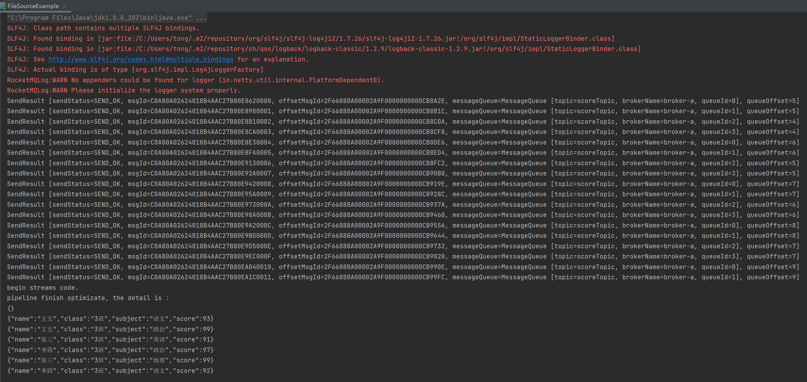

#### 题目5：利用rocketmq-streams 实现分数实时统计

基于以下数据通过 `RocketMQ Streams` 将每人分数大于 90 的科目打印打印到控制台。

数据源：

```
{"name":"张三","class":"3班","subject":"数学","score":90}
{"name":"张三","class":"3班","subject":"历史","score":81}
{"name":"张三","class":"3班","subject":"英语","score":91}
{"name":"张三","class":"3班","subject":"语文","score":70}
{"name":"张三","class":"3班","subject":"政治","score":84}
{"name":"张三","class":"3班","subject":"地理","score":99}
{"name":"李四","class":"3班","subject":"数学","score":76}
{"name":"李四","class":"3班","subject":"历史","score":83}
{"name":"李四","class":"3班","subject":"英语","score":82}
{"name":"李四","class":"3班","subject":"语文","score":92}
{"name":"李四","class":"3班","subject":"政治","score":97}
{"name":"李四","class":"3班","subject":"地理","score":89}
{"name":"王五","class":"3班","subject":"数学","score":86}
{"name":"王五","class":"3班","subject":"历史","score":88}
{"name":"王五","class":"3班","subject":"英语","score":86}
{"name":"王五","class":"3班","subject":"语文","score":93}
{"name":"王五","class":"3班","subject":"政治","score":99}
{"name":"王五","class":"3班","subject":"地理","score":88}
```


代码如下：

```java
public class FileSourceExample {
    private static final String NAMESRV_ADDRESS = "localhost:9876";

    public static void main(String[] args) {
        ProducerFromFile.produce("score.txt", NAMESRV_ADDRESS, "scoreTopic");
        
        try {
            Thread.sleep(1000 * 3);
        } catch (InterruptedException e) {
            e.printStackTrace();
        }

        System.out.println("begin streams code.");

        DataStreamSource source = StreamBuilder.dataStream("namespace", "pipeline");
        source.fromRocketmq("scoreTopic", "scoreTopicGroup", false, NAMESRV_ADDRESS)
                .filter(new FilterFunction<String>() {
                    @Override
                    public boolean filter(String value) throws Exception {
                        Score score = JSON.parseObject(value, Score.class);
                        if (score != null && Integer.parseInt(score.getScore()) > 90)
                            return true;
                        return false;
                    }
                })
                .toPrint(1)
                .start();
    }

    @Data
    @NoArgsConstructor
    @AllArgsConstructor
    static class Score {
        private String name;
        private String clazz;
        private String subject;
        private String score;
    }
}
```


执行结果截图：

