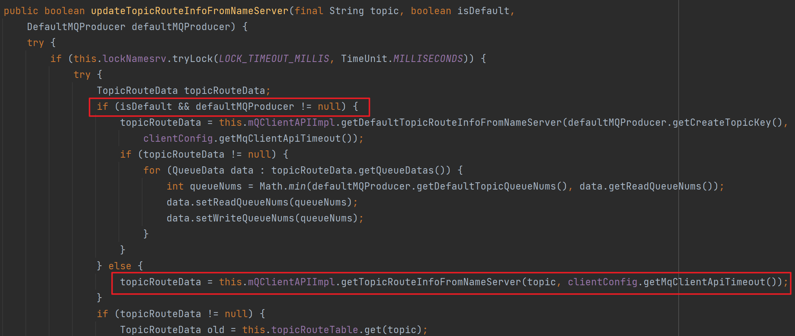
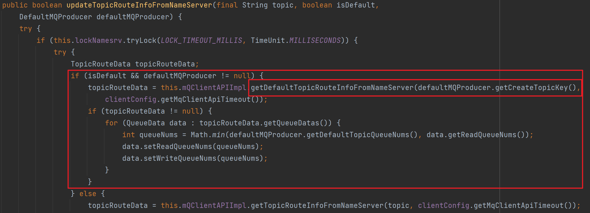
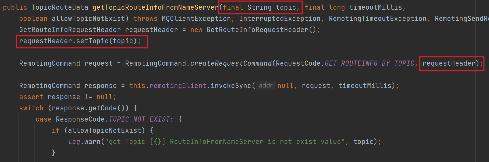
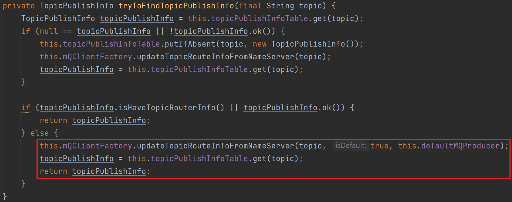

这里我想直接用3月24日课程的作业，”为什么 quickstart 的 demo 里没有创建 topic，却可以直接使用“。因为这次作业，自己的确是花费了一定时间来阅读源码，对我来说也是收获比较多的一次作业。相关内容在这里再整理一遍。


1、我们以 `example.quickstart.Producer` 为入口，去观察消息的发送流程。在 `rocketmq.client.impl.producer.DefaultMQProducerImpl` 的 `sendDefaultImpl()` 方法中，调用了 `tryToFindTopicPublishInfo(msg.getTopic())` 这个方法。那么如果对应的 Topic 不存在，应该是在这个方法中进行处理的。


2、于是进入 `tryToFindTopicPublishInfo(msg.getTopic())` 方法。

```java
private TopicPublishInfo tryToFindTopicPublishInfo(final String topic) {
    TopicPublishInfo topicPublishInfo = this.topicPublishInfoTable.get(topic);
    if (null == topicPublishInfo || !topicPublishInfo.ok()) {
        this.topicPublishInfoTable.putIfAbsent(topic, new TopicPublishInfo());
        this.mQClientFactory.updateTopicRouteInfoFromNameServer(topic);
        topicPublishInfo = this.topicPublishInfoTable.get(topic);
    }

    if (topicPublishInfo.isHaveTopicRouterInfo() || topicPublishInfo.ok()) {
        return topicPublishInfo;
    } else {
        this.mQClientFactory.updateTopicRouteInfoFromNameServer(topic, true, this.defaultMQProducer);
        topicPublishInfo = this.topicPublishInfoTable.get(topic);
        return topicPublishInfo;
    }
}
```

在调用 `topicPublishInfoTable.get(topic)` 方法时，返回值为 `null`，进入如下 `if` 语句。

```java
if (null == topicPublishInfo || !topicPublishInfo.ok()) {
    this.topicPublishInfoTable.putIfAbsent(topic, new TopicPublishInfo());
    this.mQClientFactory.updateTopicRouteInfoFromNameServer(topic);
    topicPublishInfo = this.topicPublishInfoTable.get(topic);
}
```


3、这时会创建一个新的 `TopicPublishInfo`，并执行 `mQClientFactory.updateTopicRouteInfoFromNameServer(topic)` 方法，进一步会执行 `updateTopicRouteInfoFromNameServer(topic, false, null)` 方法。


4、在 `updateTopicRouteInfoFromNameServer` 方法体内执行如下所示的方法时，最终会抛出 `MQClientException` 异常并被捕捉。




5、接着又回到2中的 `tryToFindTopicPublishInfo(msg.getTopic())` 方法，继续向下执行，并进入到 `if-else` 的 `else` 分支，并执行 `mQClientFactory.updateTopicRouteInfoFromNameServer(topic, true, this.defaultMQProducer)` 方法。

```java
if (topicPublishInfo.isHaveTopicRouterInfo() || topicPublishInfo.ok()) {
    return topicPublishInfo;
} else {
    // 进入该分支
    this.mQClientFactory.updateTopicRouteInfoFromNameServer(topic, true, this.defaultMQProducer);
    topicPublishInfo = this.topicPublishInfoTable.get(topic);
    return topicPublishInfo;
}
```


6、对于方法 `public boolean updateTopicRouteInfoFromNameServer(final String topic, boolean isDefault, DefaultMQProducer defaultMQProducer)` ，此时 `isDefault` 为 `true`，`defaultMQProducer` 不为 `null`，并且 `defaultMQProducer.getCreateTopicKey()` 的值为 `TopicValidator.AUTO_CREATE_TOPIC_KEY_TOPIC`，也就是 `"TBW102"`。




7、再往下走，执行 `getDefaultTopicRouteInfoFromNameServer(defaultMQProducer.getCreateTopicKey(), clientConfig.getMqClientApiTimeout())` ，最终会进入到 `public TopicRouteData getTopicRouteInfoFromNameServer(final String topic, final long timeoutMillis, boolean allowTopicNotExist)` 这个方法内，并且传入的参数 topic 为 `"TBW102"` 。这样就可以得到一个 topic 为 `"TBW102"` 的 `TopicRouteData` 。




8、再回到2，执行 `topicPublishInfo = this.topicPublishInfoTable.get(topic)` ，这样就可以得到 topic 为 `"TBW102"` 的 `TopicPublishInfo` 用来作为原先不存在的 topic 的 `TopicPublishInfo`。




通过以上的步骤，我们就可以解释”为什么 quickstart 的 demo 里没有创建 topic，却可以直接使用“这个问题了。

