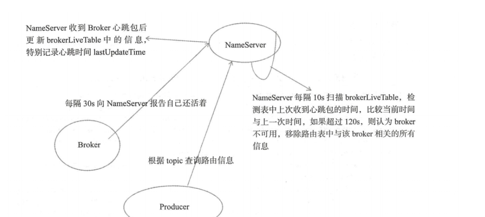

# 为什么Demo里没有创建Topic，却可以使用 
1.tryToFindTopicPublishlnfo是查找主题的路由信息的方法。如果生产者缓存了topic的路由信息，如果该路由信息中包含了消息队列，则直接返回该路由信息，如果没有缓存或没有包含消息队列， 则向nameServer
  查询该
  topic
  路由信息 如果最终未找到路由信息，则抛出异常无法找到主题相关路由信息异常
  这里我们因为
  topic
  是空的，所以会向
  nameServer
  查询这个
    topic
    的路由信息
# 元数据的生命周期图
生命周期图: