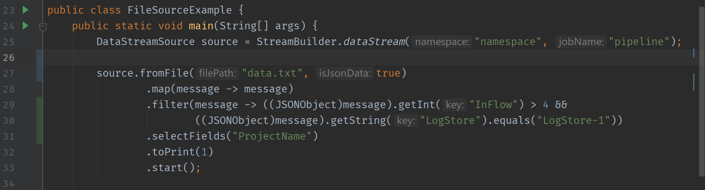

### 基于代码实例FileSourceExample以及data数据源打印出inflow大于4且LogStore为LogStore-1的projectname
代码：
```Java
package org.apache.rocketmq.streams.examples.source;

import org.apache.rocketmq.streams.client.StreamBuilder;
import org.apache.rocketmq.streams.client.source.DataStreamSource;
import org.json.JSONObject;

public class FileSourceExample {
    public static void main(String[] args) {
        DataStreamSource source = StreamBuilder.dataStream("namespace", "pipeline");

        source.fromFile("data.txt", true)
                .map(message -> message)
                .filter(message -> ((JSONObject)message).getInt("InFlow") > 4 &&
                        ((JSONObject)message).getString("LogStore").equals("LogStore-1"))
                .selectFields("ProjectName")
                .toPrint(1)
                .start();
    }
}
```
result：
